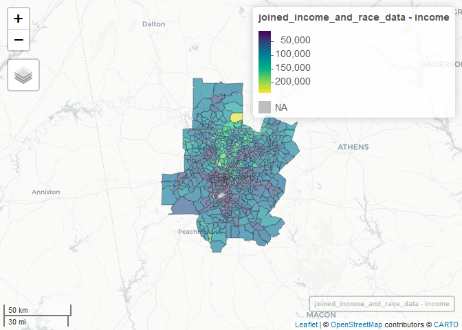
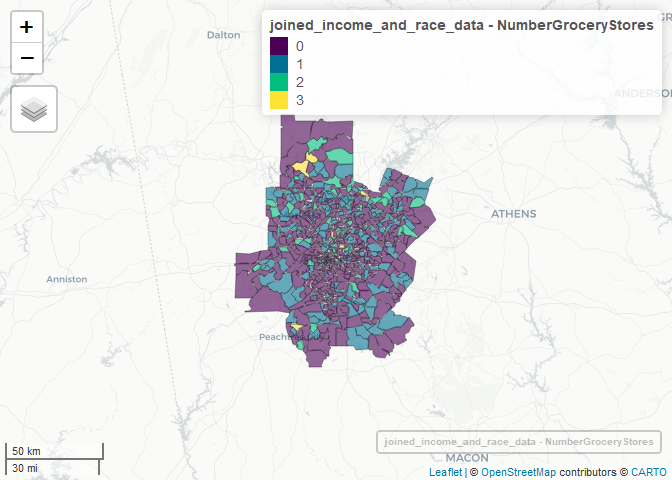
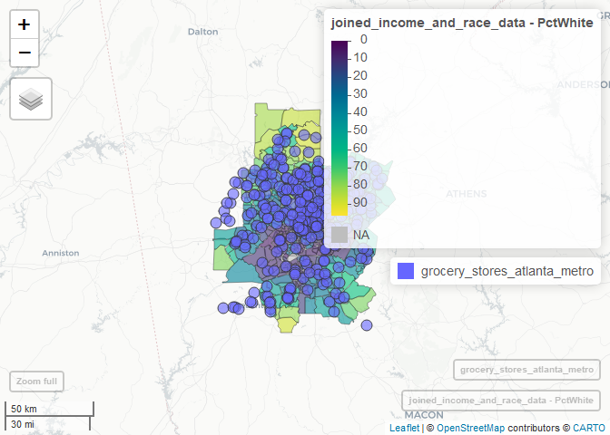
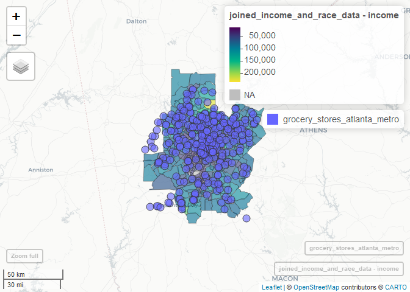
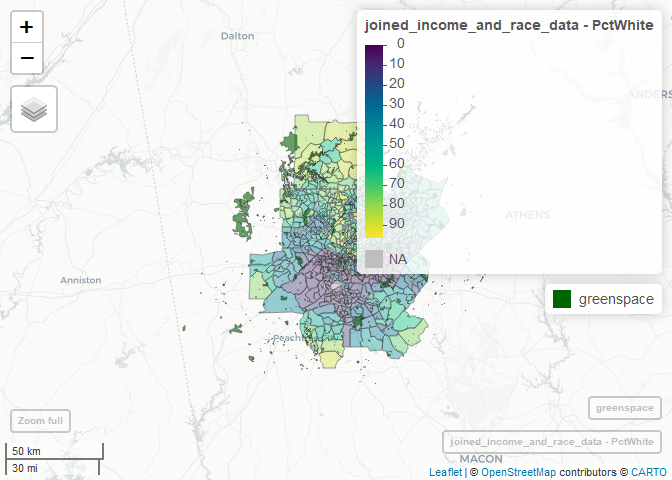

Translating QGIS data analysis to R
================

# Combine and Analyze Geospatial Data in R

This is a “translation” to R of a great presentation on QGIS at the
NICAR 2022 data journalism conference by Sean McMinn and Ruth Talbot.

Link to their QGIS slides:
<https://docs.google.com/presentation/d/19zR6xYUu7FWxby94WDf7TaAuxhOwnoAo-TAVW17DZwE/edit>

## Install and load a couple of packages

Updating rlang is usually a good idea

``` r
if(!require(pacman)) {
  install.packages("pacman")
}
install.packages("rlang")
```

Load packages with pacman. The advantage of pacman’s p_load() function
is that 1) the packages will be installed if not on your system, and 2)
they load “quietly” by default without loading messages.

``` r
pacman::p_load(dplyr, sf, mapview, readr, stringr, ggplot2)
```

## Analyze Grocery Store Data

### Load in Shapefiles and Text Data

#### Load Shapefiles

Use the sf package’s `st_read()` function to read in the two shapefiles.
You should see output with some data about those files. If you don’t
want that output generated, add the `quiet = TRUE` argument, such as
`ga_census_tracts <- st_read("Georgia_Census_Tracts/Georgia_Census_Tracts.shp", quiet = TRUE)`

``` r
ga_census_tracts <- st_read("Georgia_Census_Tracts/Georgia_Census_Tracts.shp")
```

    ## Reading layer `Georgia_Census_Tracts' from data source 
    ##   `D:\Sharon\Docs\R\NICAR-2022-QGIS\Georgia_Census_Tracts\Georgia_Census_Tracts.shp' 
    ##   using driver `ESRI Shapefile'
    ## Simple feature collection with 1969 features and 12 fields
    ## Geometry type: MULTIPOLYGON
    ## Dimension:     XY
    ## Bounding box:  xmin: -85.60516 ymin: 30.35576 xmax: -80.78296 ymax: 35.0013
    ## Geodetic CRS:  NAD83

``` r
grocery_stores_atlanta_metro <- st_read("Grocery_Stores_Atlanta_Metro/Grocery_Stores_Atlanta_Metro.shp")
```

    ## Reading layer `Grocery_Stores_Atlanta_Metro' from data source 
    ##   `D:\Sharon\Docs\R\NICAR-2022-QGIS\Grocery_Stores_Atlanta_Metro\Grocery_Stores_Atlanta_Metro.shp' 
    ##   using driver `ESRI Shapefile'
    ## Simple feature collection with 300 features and 9 fields
    ## Geometry type: POINT
    ## Dimension:     XY
    ## Bounding box:  xmin: -84.88864 ymin: 33.29327 xmax: -83.88602 ymax: 34.26105
    ## Geodetic CRS:  WGS 84

**Same task in their QGIS instructions**

-   In QGIS, go to Layer > Add Layer > Add Vector Layer
-   In the pop-up window that opens:
    -   Source Type = File should be the default, but if it isn’t,
        select that.
    -   In Vector Dataset(s) under ‘Source’, open the file finder (3
        dots to the right)
        -   In the data provided, select Georgia_Census_Tracts >
            Georgia_Census_Tracts.shp.
    -   Once the .shp file is selected, click ‘Add’.
-   Repeat this process with the Grocery_Stores_Atlanta_Metro shapefile.
-   Click ‘Close’ to close the window and view the data. You should see
    both datasets load in the view and their names listed in the
    ‘Layers’ section to the bottom left.

#### Load Text Data

Use readr’s read_csv() function to read in the CSV files. As with
`st_read()` you’ll get some information about the data. As the message
says, you can add the argument `show_col_types = FALSE` to stop the info
output.

``` r
income <- read_csv("Income data/income.csv")
```

    ## Rows: 1970 Columns: 2
    ## -- Column specification --------------------------------------------------------
    ## Delimiter: ","
    ## chr (2): GEO_ID, S1903_C03_001E
    ## 
    ## i Use `spec()` to retrieve the full column specification for this data.
    ## i Specify the column types or set `show_col_types = FALSE` to quiet this message.

``` r
race <- read_csv("Race data/race.csv")
```

    ## Rows: 1970 Columns: 3
    ## -- Column specification --------------------------------------------------------
    ## Delimiter: ","
    ## chr (3): DP05_0001E, DP05_0077PE, GEO_ID
    ## 
    ## i Use `spec()` to retrieve the full column specification for this data.
    ## i Specify the column types or set `show_col_types = FALSE` to quiet this message.

**Same task in their QGIS instructions**

-   Go to Layer > Add Layer > Add Delimited Text Layer
-   Browse to the Income folder in the data and select the .csv in the
    folder named ‘income.csv’ and click ‘Open’
-   Under Geometry Definition, make sure ‘No geometry’ is selected.
    (Census data will have GEOIDs we can use to join with geometric
    data, but it does not contain geometry itself.)
-   Repeat the process for ‘Race data’

### Join Data

#### Filter Shapefile by ID to Get Counties of Interest

Based on the QGIS instructions, we only want census tracks where the
first five numbers start with a specific group, as I can see in the QGIS
instructions. Here’s how to do that in R using the dplyr package’s
`filter()` function:

``` r
ga_census_tracts <- filter(ga_census_tracts, 
                           substr(GEOID, 1, 5) %in% 
                             c('13057', '13063', '13067', '13089', '13097', '13113', '13121', '13135', '13151', '13247')
                           )
```

**QGIS instructions**

-   For the Georgia_Census_Tracts, go to Attribute Table and click on
    ’Select Features by Expression” (looks like an E and a square)

-   In the expression area, paste the formula below

    array_contains( array(‘13057’, ‘13063’, ‘13067’, ‘13089’, ‘13097’,
    ‘13113’, ‘13121’, ‘13135’, ‘13151’, ‘13247’), left( “GEOID”, 5))

-   Click ‘Select Features’ on the bottom right, and then hit ‘Close’

    -   You should see the tracts within those counties highlighted

-   Right click on the file and go to Export > Export Selected Features
    As

    -   Important: select the ‘Selected’ Features option, which is the
        second option, not just export features as

-   And save files as Atlanta_Metro_Census_Tracts or something similar.
    That should now appear in your layers bar.

-   Unselect or Remove Georgia_Census_Tracts, we won’t be using it
    anymore.

#### Change field values in QGIS

To join data with geometries to data without geometries, we need a field
to join across datasets.

To inspect a dataset’s attributes, right click on the dataset in the
Layers panel (bottom left) \> Open Attribute Table

*With R, one way to do this inspection is with dplyr’s `glimpse()`
function: *

``` r
glimpse(income)
```

    ## Rows: 1,970
    ## Columns: 2
    ## $ GEO_ID         <chr> "id", "1400000US13001950100", "1400000US13001950200", "~
    ## $ S1903_C03_001E <chr> "Estimate!!Median income (dollars)!!HOUSEHOLD INCOME BY~

The income column came in as characters (see the <chr>). Let’s add a
column called income that’s integers:

``` r
income <- income %>%
  mutate(
    income = parse_number(S1903_C03_001E)
  )
```

    ## Warning: 18 parsing failures.
    ## row col expected                                                                                                               actual
    ##   1  -- a number Estimate!!Median income (dollars)!!HOUSEHOLD INCOME BY RACE AND HISPANIC OR LATINO ORIGIN OF HOUSEHOLDER!!Households
    ## 133  -- a number -                                                                                                                   
    ## 167  -- a number -                                                                                                                   
    ## 246  -- a number -                                                                                                                   
    ## 271  -- a number -                                                                                                                   
    ## ... ... ........ ....................................................................................................................
    ## See problems(...) for more details.

and same for race

``` r
race <- race %>%
  mutate(
    PctWhite = parse_number(DP05_0077PE)
  )
```

    ## Warning: 14 parsing failures.
    ## row col expected                                                                                      actual
    ##   1  -- a number Percent!!HISPANIC OR LATINO AND RACE!!Total population!!Not Hispanic or Latino!!White alone
    ## 133  -- a number -                                                                                          
    ## 167  -- a number -                                                                                          
    ## 246  -- a number -                                                                                          
    ## 271  -- a number -                                                                                          
    ## ... ... ........ ...........................................................................................
    ## See problems(...) for more details.

**QGIS instructions to make the joining fields the same format**

Open the attribute table for either census dataset (Income or Race) and
look at the column GEO_ID. It should be in the format
1400000US13001950100. Notice how they all have the prefix ‘1400000US’ —
the only meaningful digits for us are the last 11: The first two digits,
`13`, represents the FIPS code for Georgia, the next 3 digits indicate
the county, and the last 6 indicate census tracts/block etc.

Open the attribute table for the Atlanta_Metro_Census_Tracts shapefile,
and you’ll see the GEOIDs are in the format 13001950100 (missing the
prefix), so we need to change them to match. To do that, follow steps
below: - Select the Field calculator in the top menu (looks like an
abacus) - Set ‘Output Field’ = `id` or some similar name - Set ‘Output
Field type’ = Text(string) - Set ‘Output Field length’ = 20 (must be
large enough to accomodate a 20-letter id) - In the expression box
(empty text box below), type ‘1400000US’ + “GEOID” - This tells the
Field Calculator to create a new field of type string, but adding the
`1400000US` prefix to each GEOID - Click ‘Ok’

**R instructions**

Base R’s `paste0()` function combines strings with other strings or with
data fields. It’s `paste0` to add zero spaces between the things being
combined `paste()` automatically adds a space by default unless you tell
it not to.

sf’s joining function is going to expect a joining column with the same
name as well as the same format, so I’m naming my new ID column
`GEO_ID`, because that’s what it’s called in the income file.

``` r
ga_census_tracts <- ga_census_tracts %>%
  mutate(
    id = paste0('1400000US', GEOID)
  )
```

Note: Another format puts the string in quotation marks and anything you
want to be calculated, like the name of a column in the data, goes
inside braces. This is a common syntax in many programming languages. In
R, the package glue gives this syntax. The stringr packages str_glue()
uses this as well. This is an option to the above code:

``` r
ga_census_tracts <- ga_census_tracts %>%
  mutate(
    id = str_glue('1400000US{GEOID}')
  )
```

#### Join data on Field

Joining on income:

``` r
joined_income_data <- left_join(ga_census_tracts, income, by = c("id" = "GEO_ID"))
```

`left_join()` means “keep everything in the first data set and add all
the matching rows in the second data set.” In this case, the census
tracts must come first so the resulting object is still a geospatial
item from the shapefile.

Since the two joining columns have different names, I had to specify
that the “id” column in ga_census_tracts should be joined with the
“GEO_ID” column in income.

Let’s do the same for race:

``` r
joined_income_and_race_data <- left_join(joined_income_data, race, by = c("id" = "GEO_ID"))
```

**QGIS instructions**

-   Double click on the Atlanta_metro_area in the Layers area
-   Click on the ‘Joins’ option on the left-hand side of the pop up
-   Click the green plus button on the bottom left
-   Set Join Layer = to either Income or Race data
-   Set Join field = GEO_ID (or whatever the id field is)
-   Set Target field = the new field in we created in the step above,
    `id`
-   Click ‘Ok’. It might take a second but you should see a join appear
    in the Joins box

### Visualize the Data (Optional)

There are many ways to do this in R, but in my opinion by far the
easiest is with mapview:

``` r
mapview(joined_income_and_race_data, zcol = "income")
```

<!-- -->

There’s lots of ways to customize mapview maps. You can learn more about
the mapview R package in my [InfoWorld article “Astonishingly easy
mapping in R with
mapview”](https://www.infoworld.com/article/3644848/astonishingly-easy-mapping-in-r-with-mapview.html)
and companion [video on YouTube](https://youtu.be/pHOto3VDG9s).

**QGIS instructions**

-   Double click the Atlanta_Metro_Census_Tracts layer again
-   Go to ‘Symbology’
-   In ‘Value’, select the column you want to color by.
    -   If you don’t see the column you want appear, it may be the wrong
        type. To convert from string to number, click the E sign next to
        the Value dropdown and paste to_int( “income_S1903_C03_001E”)
        into the expression area.
-   In the dropdown at the top, select ‘Graduated’ (default should be
    ‘Single Symbol’)
-   On the bottom right, increase the number of ‘Classes’ to somewhere
    around 10.
-   Check the ranges generated are expected given whatever the data
    is.  
-   Click ‘Ok’

This will tell QGIS to color the geodata by whatever property you
select, giving you a way to eyeball the data, looking for possible
trends.

### Count Number of Grocery Stores in Each Tract

Before doing any kind of calculations like this, we want to make sure
both data sets are using the same “coordinate reference system” (how
they portray a three-dimensional world in a two-dimensional format). We
can use the sf package’s `st_crs()` function to check:

``` r
st_crs(joined_income_and_race_data)
```

    ## Coordinate Reference System:
    ##   User input: NAD83 
    ##   wkt:
    ## GEOGCRS["NAD83",
    ##     DATUM["North American Datum 1983",
    ##         ELLIPSOID["GRS 1980",6378137,298.257222101,
    ##             LENGTHUNIT["metre",1]]],
    ##     PRIMEM["Greenwich",0,
    ##         ANGLEUNIT["degree",0.0174532925199433]],
    ##     CS[ellipsoidal,2],
    ##         AXIS["latitude",north,
    ##             ORDER[1],
    ##             ANGLEUNIT["degree",0.0174532925199433]],
    ##         AXIS["longitude",east,
    ##             ORDER[2],
    ##             ANGLEUNIT["degree",0.0174532925199433]],
    ##     ID["EPSG",4269]]

``` r
st_crs(grocery_stores_atlanta_metro)
```

    ## Coordinate Reference System:
    ##   User input: WGS 84 
    ##   wkt:
    ## GEOGCRS["WGS 84",
    ##     DATUM["World Geodetic System 1984",
    ##         ELLIPSOID["WGS 84",6378137,298.257223563,
    ##             LENGTHUNIT["metre",1]]],
    ##     PRIMEM["Greenwich",0,
    ##         ANGLEUNIT["degree",0.0174532925199433]],
    ##     CS[ellipsoidal,2],
    ##         AXIS["latitude",north,
    ##             ORDER[1],
    ##             ANGLEUNIT["degree",0.0174532925199433]],
    ##         AXIS["longitude",east,
    ##             ORDER[2],
    ##             ANGLEUNIT["degree",0.0174532925199433]],
    ##     ID["EPSG",4326]]

*They don’t.* I’m going to change the joined data object to 4326 since
that’s what’s used for many popular background tiles like Google Maps,
just in case we want an interactive map.

``` r
joined_income_and_race_data <- st_transform(joined_income_and_race_data, 4326)
st_crs(joined_income_and_race_data)
```

    ## Coordinate Reference System:
    ##   User input: EPSG:4326 
    ##   wkt:
    ## GEOGCRS["WGS 84",
    ##     DATUM["World Geodetic System 1984",
    ##         ELLIPSOID["WGS 84",6378137,298.257223563,
    ##             LENGTHUNIT["metre",1]]],
    ##     PRIMEM["Greenwich",0,
    ##         ANGLEUNIT["degree",0.0174532925199433]],
    ##     CS[ellipsoidal,2],
    ##         AXIS["geodetic latitude (Lat)",north,
    ##             ORDER[1],
    ##             ANGLEUNIT["degree",0.0174532925199433]],
    ##         AXIS["geodetic longitude (Lon)",east,
    ##             ORDER[2],
    ##             ANGLEUNIT["degree",0.0174532925199433]],
    ##     USAGE[
    ##         SCOPE["Horizontal component of 3D system."],
    ##         AREA["World."],
    ##         BBOX[-90,-180,90,180]],
    ##     ID["EPSG",4326]]

Now we can do intersection calculations. st_intersects() does the
geographic work to find which point intersects which polygon, but the
output isn’t really human readable. Using the lengths() function with
that turns it into something that’s not only easy to read, but is in a
format that we can add to our data set:

``` r
joined_income_and_race_data$NumberGroceryStores <- lengths(st_intersects(joined_income_and_race_data, grocery_stores_atlanta_metro))
```

Simple map of number grocery stores:

``` r
mapview(joined_income_and_race_data, zcol = "NumberGroceryStores")
```

<!-- -->

To save just a CSV with GEOID, median income, percent, population, and
the # grocery stores for every tract in the Atlanta Metro Area as done
with QGIS below, you can run

``` r
write_csv(joined_income_and_race_data[, c("GEOID", "income", "PctWhite", "NumberGroceryStores")], file = "AnalysisResults/MetroAtlantaIncomeRaceGroceryStores.csv")
```

**QGIS instructions**

-   Go to Vector > Analysis Tools > Count Points in Polygon
-   Select ‘Polygons’ = to the Atlanta_metro_area layer
-   Select the Points = to the Grocery_Stores_Atlanta_Metro layer
-   Make sure ‘Count Field Name’ = NUMPOINTS
    -   This tells QGIS to sum by # of points in each polygon/tract
-   Click ‘Run’
-   You should see a new layer called ‘Count’ in the layers area
-   Right click on ‘Count’ and go to Export > Save Features As and save
    the file as a .csv

You should now have a .csv with GEOID, median income, % white,
population, and the # grocery stores for every tract in the Atlanta
Metro Area! Analyze however you prefer — but we can talk you through
some basic ideas :)

**Map the grocery stores and race**

``` r
mapview(joined_income_and_race_data, zcol = "PctWhite") + grocery_stores_atlanta_metro
```

<!-- -->

**Map the grocery stores and income**

(This will be more useful if you do it on your own system and can expand
it so the circles aren’t all on top of each other)

``` r
mapview(joined_income_and_race_data, zcol = "income") + grocery_stores_atlanta_metro
```

<!-- -->

## Optional Next Exercise – Area Analysis

Finding the park-tract intersection *polygons* with this data took a
*very* long time in R with the sf package’s `st_intersection()`
function. The `st_intersects()` function is much faster, but only gives
you which tracts are intersected by the parks, not the area, which is a
problem for parks that span multiple tracts. I would use QGIS for this.

But it’s easy to *visualize* both data sets with R and mapview.

``` r
greenspace <- st_read("Atlanta Greenspace/Greenspace.shp")
```

    ## Reading layer `Greenspace' from data source 
    ##   `D:\Sharon\Docs\R\NICAR-2022-QGIS\Atlanta Greenspace\Greenspace.shp' 
    ##   using driver `ESRI Shapefile'
    ## Simple feature collection with 3618 features and 13 fields (with 5 geometries empty)
    ## Geometry type: MULTIPOLYGON
    ## Dimension:     XY
    ## Bounding box:  xmin: -85.27001 ymin: 33.18238 xmax: -83.59467 ymax: 34.50145
    ## Geodetic CRS:  WGS 84

``` r
mapview(joined_income_and_race_data, zcol = "PctWhite", alpha.regions = 0.4) + mapview(greenspace, col.regions = "darkgreen")
```

<!-- -->

**QGIS instructions**

Sometimes the geodata we want to analyse isn’t lat/lngs, it’s area. For
instance, we might want to look at the % of each census tract in the
Atlanta Metro area that is public park.

-   First, load in the Greenspace data set from the data folder, then
    follow the instructions below.

### Calculate Area of Census Tracts

We need to add in an area field to each census tract, so we know the
area covered by each tract

-   Open the Field Calculator for the Atlanta Census Tract layer
-   Set ‘Output Field’ = `tract_area` or some similar name
-   Set ‘Output Field type’ = Decimal number
-   Type the expression `$area` in the text field
-   Click ‘Ok’

This might take a second, because it’s calcuating the area covered by
each tract.

### Calculate Difference between Tract and Parks

-   Go to Vector > Geoprocessing Tools > Difference
-   Select the Input Layer = Atlanta Census Tract layer and the Overlay
    = Greenspace
-   Click ‘Run’

You should see a new layer called ‘Difference’ outputted, unselect
Greenspace and Atlanta Tract Area to see it more clearly. This contains
the parts of census tracts NOT covered in park, but still contain the
census tract total area as a field.

### Calculate New Area of Census Tracts Without Parks

Do the same calculation we did above, just with these new polygons.

-   Open the Field Calculator for the Difference layer
-   Set ‘Output Field’ = `tract_area` or some similar name
-   Set ‘Output Field type’ = Decimal number
-   Type the expression `$area` in the text field
-   Click ‘Ok’

### Calculate the % of Total Area

-   Open the Field Calculator again

-   Set ‘Output Field’ = `percent` or some similar name

-   Set ‘Output Field type’ = Decimal number  

-   Enter the expression below and click ‘Ok’

    1 - “area_part” / “area_full”

This will add a field with the percent of tract covered by greenspace.

Export and analyze!
